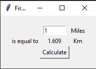

# Miles to Kilometers Converter

### This is my First program with Tkinter. Tkinter is a Python binding to the Tk GUI toolkit. It is the standard Python interface to the Tk GUI toolkit, and is Python's de facto standard GUI.
## Description
### This was a new thing for me, and I really enjoyed Learning this New thing.